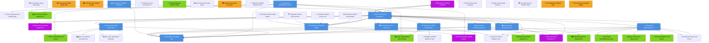

```mermaid
flowchart TD

    agent_reconciliation["🔍 Reconciliation Agent (Exchange"]
    architect_highlevel_module["🏛️ Architect (System & Module Des"]
    auditor_concurrency_safety["🔒 Concurrency Safety Auditor (Ra"]
    auditor_financial_logic["💰 Financial Logic Auditor (Capit"]
    bmo_holistic_intent_verifier["🔬 BMO Worker (Holistic Cognitive"]
    bmo_system_model_synthesizer["📝 BMO Worker (As-Built System Mo"]
    calculator_performance_fee["💎 Performance Fee Calculator (Hi"]
    code_comprehension_assistant_v2["🧐 Code Comprehension (SPARC Alig"]
    coder_framework_boilerplate["🧱 Coder Boilerplate (SPARC Align"]
    coder_test_driven["👨💻 Coder (State-Based TDD & Refac"]
    debugger_targeted["🎯 Debugger (SPARC Aligned & Syst"]
    devils_advocate_critical_evaluator["🧐 Devil's Advocate (Cognitive Tr"]
    docs_writer_feature["📚 Docs Writer (SPARC Aligned & R"]
    edge_case_synthesizer["🔍 Edge Case Synthesizer (Boundar"]
    generator_client_portal["📊 Client Portal Generator (Real-"]
    guardian_capital_preservation["🛡️ Capital Preservation Guardian "]
    optimizer_module["🧹 Optimizer (SPARC Aligned & Ref"]
    orchestrator_goal_clarification["🗣️ Orchestrator (Core Intent Vali"]
    orchestrator_simulation_synthesis["🚀 Orchestrator (Simulation Synth"]
    orchestrator_sparc_architecture_phase["🏛️ Orchestrator (Architecture & T"]
    orchestrator_sparc_completion_documentation["📚 Orchestrator (SPARC Completion"]
    orchestrator_sparc_completion_maintenance["🔄 Orchestrator (Maintenance & RU"]
    orchestrator_sparc_pseudocode_phase["✍️ Orchestrator (Pseudocode & Tri"]
    orchestrator_sparc_refinement_implementation["⚙️ Orchestrator (TDD Implementati"]
    orchestrator_sparc_refinement_testing["🎯 Orchestrator (State-Based TDD "]
    orchestrator_sparc_specification_phase["🌟 Orchestrator (Specification & "]
    orchestrator_state_scribe["🧠 Orchestrator (Intelligent Stat"]
    pseudocode_writer["✍️ Pseudocode Writer (Detailed Lo"]
    recorder_audit_trail["📜 Audit Trail Recorder (Cryptogr"]
    research_planner_strategic["🔎 Research Planner (Adaptive Mul"]
    researcher_high_level_tests["🔬 Researcher (High-Level Test St"]
    ruler_quality_evaluator["📏 RULER (Relative Quality Evalua"]
    sample_code_quality_checker["✅ Sample Code Quality Checker"]
    security_reviewer_module["🛡️ Security Reviewer (SPARC Align"]
    simulation_worker_data_synthesizer["💾 Simulation Worker (Data Synthe"]
    simulation_worker_environment_setup["🏗️ Simulation Worker (Environment"]
    simulation_worker_service_virtualizer["👻 Simulation Worker (Service Vir"]
    simulation_worker_test_generator_multi_method["✍️ Simulation Worker (Multi-Metho"]
    spec_to_testplan_converter["🗺️ Spec-To-TestPlan Converter (Gr"]
    spec_writer_comprehensive["📝 Spec Writer (Comprehensive Spe"]
    spec_writer_from_examples["✍️ Spec Writer (User Stories & Ex"]
    tester_acceptance_plan_writer["✅ Tester (Acceptance Test Plan &"]
    tester_tdd_master["🧪 Tester (TDD Adherent & AI-Outc"]
    uber_orchestrator["🧐 UBER Orchestrator (Cognitive T"]
    validator_api_integration["🔌 API Integration Validator (Ext"]
    validator_performance_constraint["⚡ Performance Constraint Validat"]

    bmo_holistic_intent_verifier --> uber_orchestrator
    bmo_system_model_synthesizer --> uber_orchestrator
    edge_case_synthesizer --> orchestrator_sparc_refinement_testing
    orchestrator_goal_clarification --> uber_orchestrator
    orchestrator_goal_clarification --> orchestrator_state_scribe
    orchestrator_goal_clarification --> research_planner_strategic
    orchestrator_simulation_synthesis --> uber_orchestrator
    orchestrator_simulation_synthesis --> bmo_holistic_intent_verifier
    orchestrator_simulation_synthesis --> orchestrator_state_scribe
    orchestrator_simulation_synthesis --> ruler_quality_evaluator
    orchestrator_sparc_architecture_phase --> uber_orchestrator
    orchestrator_sparc_architecture_phase --> devils_advocate_critical_evaluator
    orchestrator_sparc_architecture_phase --> orchestrator_state_scribe
    orchestrator_sparc_architecture_phase --> architect_highlevel_module
    orchestrator_sparc_completion_documentation --> docs_writer_feature
    orchestrator_sparc_completion_documentation --> uber_orchestrator
    orchestrator_sparc_completion_documentation --> orchestrator_state_scribe
    orchestrator_sparc_completion_maintenance --> tester_tdd_master
    orchestrator_sparc_completion_maintenance --> coder_test_driven
    orchestrator_sparc_completion_maintenance --> docs_writer_feature
    orchestrator_sparc_completion_maintenance --> orchestrator_state_scribe
    orchestrator_sparc_completion_maintenance --> ruler_quality_evaluator
    orchestrator_sparc_completion_maintenance --> uber_orchestrator
    orchestrator_sparc_completion_maintenance --> code_comprehension_assistant_v2
    orchestrator_sparc_pseudocode_phase --> pseudocode_writer
    orchestrator_sparc_pseudocode_phase --> uber_orchestrator
    orchestrator_sparc_pseudocode_phase --> devils_advocate_critical_evaluator
    orchestrator_sparc_pseudocode_phase --> orchestrator_state_scribe
    orchestrator_sparc_refinement_implementation --> coder_test_driven
    orchestrator_sparc_refinement_implementation --> debugger_targeted
    orchestrator_sparc_refinement_implementation --> uber_orchestrator
    orchestrator_sparc_refinement_implementation --> orchestrator_state_scribe
    orchestrator_sparc_refinement_implementation --> ruler_quality_evaluator
    orchestrator_sparc_refinement_testing --> tester_tdd_master
    orchestrator_sparc_refinement_testing --> spec_to_testplan_converter
    orchestrator_sparc_refinement_testing --> edge_case_synthesizer
    orchestrator_sparc_refinement_testing --> uber_orchestrator
    orchestrator_sparc_refinement_testing --> orchestrator_state_scribe
    orchestrator_sparc_specification_phase --> spec_writer_comprehensive
    orchestrator_sparc_specification_phase --> spec_writer_from_examples
    orchestrator_sparc_specification_phase --> tester_acceptance_plan_writer
    orchestrator_sparc_specification_phase --> orchestrator_state_scribe
    orchestrator_sparc_specification_phase --> researcher_high_level_tests
    orchestrator_sparc_specification_phase --> research_planner_strategic
    orchestrator_sparc_specification_phase --> uber_orchestrator
    orchestrator_sparc_specification_phase --> devils_advocate_critical_evaluator
    researcher_high_level_tests --> orchestrator_sparc_specification_phase
    simulation_worker_data_synthesizer --> orchestrator_simulation_synthesis
    simulation_worker_environment_setup --> orchestrator_simulation_synthesis
    simulation_worker_service_virtualizer --> orchestrator_simulation_synthesis
    simulation_worker_test_generator_multi_method --> orchestrator_simulation_synthesis
    spec_writer_comprehensive --> orchestrator_sparc_specification_phase
    uber_orchestrator --> orchestrator_sparc_refinement_testing
    uber_orchestrator --> bmo_holistic_intent_verifier
    uber_orchestrator --> orchestrator_sparc_refinement_implementation
    uber_orchestrator --> research_planner_strategic
    uber_orchestrator --> bmo_system_model_synthesizer
    uber_orchestrator --> orchestrator_sparc_pseudocode_phase
    uber_orchestrator --> orchestrator_sparc_architecture_phase
    uber_orchestrator --> orchestrator_sparc_specification_phase
    uber_orchestrator --> orchestrator_goal_clarification
    uber_orchestrator --> orchestrator_simulation_synthesis
    uber_orchestrator --> devils_advocate_critical_evaluator

    classDef orchestrator fill:#4A90E2,stroke:#2E5C8A,color:#fff
    classDef worker fill:#7ED321,stroke:#5A9B18,color:#000
    classDef validator fill:#F5A623,stroke:#B87A1A,color:#000
    classDef quality fill:#BD10E0,stroke:#8A0BA8,color:#fff

    class architect_highlevel_module,coder_framework_boilerplate,coder_test_driven,docs_writer_feature,pseudocode_writer,spec_writer_comprehensive,spec_writer_from_examples,tester_acceptance_plan_writer,tester_tdd_master worker
    class auditor_concurrency_safety,auditor_financial_logic,guardian_capital_preservation,validator_api_integration,validator_performance_constraint validator
    class bmo_holistic_intent_verifier,bmo_system_model_synthesizer,devils_advocate_critical_evaluator,ruler_quality_evaluator quality
    class orchestrator_goal_clarification,orchestrator_simulation_synthesis,orchestrator_sparc_architecture_phase,orchestrator_sparc_completion_documentation,orchestrator_sparc_completion_maintenance,orchestrator_sparc_pseudocode_phase,orchestrator_sparc_refinement_implementation,orchestrator_sparc_refinement_testing,orchestrator_sparc_specification_phase,orchestrator_state_scribe,uber_orchestrator orchestrator
```